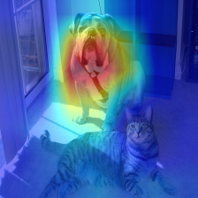

# GradCAM
A PyTorch implementation of Grad-CAM based on ICCV 2017 paper 
[Grad-CAM: Visual Explanations from Deep Networks via Gradient-based Localization](https://arxiv.org/abs/1610.02391).

## Requirements
* [Anaconda](https://www.anaconda.com/download/)
* PyTorch
```
conda install pytorch torchvision -c pytorch
```
* opencv
```
conda install opencv
```

## Usage
```
python vis_grad_cam.py --image_name dog_and_cat.png --save_name result.png
optional arguments:
--image_name              the tested image name [default value is both.png]
--save_name               saved image name [default value is grad_cam.png]
```

## Result


